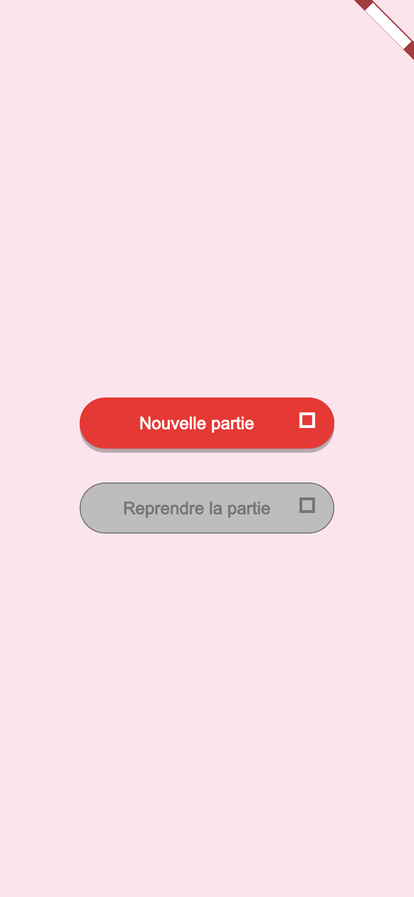

# TicTacToe

Local Tic-Tac-Toe game built with Flutter. The game is offline only: a human player competes against a
local CPU opponent.

This repository is a Betclic Flutter technical test. The goal is not to build a large game engine, but to
show production-ready Flutter engineering practices: Clean Architecture, feature-first organization,
dependency inversion, testable business logic, Riverpod state management, GoRouter navigation, and
maintainable code.



## Features

### Current Features

- Human vs CPU gameplay.
- New game creation from the home screen.
- Resume game entry point when a saved game exists.
- Turn management for human and CPU players.
- Win and draw detection.
- End-of-game state handling inside the game screen.
- Local game persistence with `SharedPreferences`.
- CPU difficulty selection before starting a new game.
- Invalid action prevention, including occupied cells, finished games, and CPU turns.

## Technical Stack

| Area | Choice |
| --- | --- |
| Framework | Flutter |
| Language | Dart `^3.12.1` |
| State management and DI | Riverpod 3 with code generation |
| Navigation | GoRouter |
| Immutability | freezed |
| Persistence | SharedPreferences |
| Logging | Talker |
| Tests | `flutter_test`, Mockito, manual fakes |
| Code generation | build_runner, riverpod_generator, freezed, json_serializable |

## Architecture

The project follows Clean Architecture principles with a feature-first structure.

The dependency rule is:

```text
Presentation -> DI -> Domain <- Data
```

The domain layer stays independent from Flutter, Riverpod, GoRouter, and platform SDKs. Business rules
live in domain entities and use cases. Notifiers orchestrate use cases and expose immutable UI state.
Repositories hide persistence details behind domain abstractions.

## Folder Structure

```text
lib/
├── app/
│   ├── app.dart
│   └── router.dart
├── core/
│   ├── constants/
│   ├── error/
│   ├── hooks/
│   ├── navigation/
│   ├── providers/
│   ├── result/
│   ├── theme/
│   └── widgets/
├── features/
│   ├── game/
│   │   ├── data/
│   │   ├── di/
│   │   ├── domain/
│   │   ├── navigation/
│   │   └── presentation/
│   └── home/
│       ├── di/
│       ├── domain/
│       ├── navigation/
│       └── presentation/
└── l10n/
```

## Dependency Injection

Dependencies are wired with Riverpod code generation. Providers live in the composition layer, not in
domain code:

- Use case providers live in `lib/features/<feature>/di/`.
- Repository and data source providers live in `lib/features/<feature>/di/`.
- Notifier providers live in `lib/features/<feature>/presentation/notifiers/`.
- Runtime providers such as `SharedPreferences` live in `lib/core/providers/`.

## Getting Started

### Prerequisites

- Flutter SDK compatible with Dart `^3.12.1`.
- Git.

### Clone Repository

```bash
git clone https://github.com/KYPixedition/TicTacToe.git
cd TicTacToe
```

### Install Dependencies

```bash
flutter pub get
```

### Run Application

```bash
flutter run
```

### Code Generation

After changing `@riverpod`, `freezed`, or `json_serializable` sources, regenerate code with:

```bash
dart run build_runner build --delete-conflicting-outputs
```

Generated files (`.g.dart`, `.freezed.dart`) are committed to the repository.

## Quality Checks

Run static analysis:

```bash
dart analyze
```

Run tests:

```bash
flutter test
```

## Testing Strategy

The test suite focuses on behavior that is valuable to keep stable:

- Domain and use case tests for game rules, win detection, draw detection, invalid moves, and CPU moves.
- Notifier tests for orchestration, persistence calls, state transitions, and navigation requests.
- Widget tests for visible UI behavior and key user interactions.

Business rules are tested independently from Flutter widgets whenever possible, which keeps failures easier
to diagnose.

## Development Guidelines

The project follows these conventions:

- Feature-first architecture.
- SOLID principles.
- No business logic inside widgets.
- No direct dependency between features.
- Explicit dependency injection.
- Immutable domain entities and UI states.
- Small and focused classes.
- Tests for business-critical logic.
- Talker for application logging instead of `print()`.

## AI-Assisted Development

Cursor was used as an AI development assistant for this project. The goal was not to let the AI decide the
architecture freely, but to constrain it with explicit project rules and a user-story delivery workflow.

The repository includes local rules under [`.cursor/rules/`](.cursor/rules/) to keep generated and assisted
changes aligned with the expected codebase standards:

- [`general.mdc`](.cursor/rules/general.mdc): naming, imports, null safety, generated files, and repository-wide
  conventions.
- [`dart.mdc`](.cursor/rules/dart.mdc): Dart style, immutability, constructors, error handling, and
  documentation.
- [`feature-architecture.mdc`](.cursor/rules/feature-architecture.mdc): feature-first Clean Architecture
  boundaries.
- [`riverpod-providers.mdc`](.cursor/rules/riverpod-providers.mdc): Riverpod 3 code generation and provider
  placement.
- [`navigation.mdc`](.cursor/rules/navigation.mdc): GoRouter usage through feature navigation abstractions.
- [`presentation.mdc`](.cursor/rules/presentation.mdc): widget extraction, view responsibilities, and UI state
  orchestration.
- [`flutter-infra.mdc`](.cursor/rules/flutter-infra.mdc): bootstrap, runtime providers, router, theme, and
  logging.
- [`design-system.mdc`](.cursor/rules/design-system.mdc): ThemeExtension-based colors, typography, spacing, and
  reusable UI patterns.
- [`testing.mdc`](.cursor/rules/testing.mdc): unit, notifier, widget, fake, and Mockito testing conventions.
- [`agent-review.mdc`](.cursor/rules/agent-review.mdc): local review focus for runtime and functional
  regressions.

The `.cursor/skills/` workflow also structures delivery by user story: Product Owner analysis, implementation
planning, development, local review, pull request creation, and post-merge cleanup.

## Reviewer Notes

The main architectural decisions to review are:

1. Clean Architecture separation.
2. Feature-first organization.
3. Riverpod dependency management.
4. Testability of business logic.
5. Navigation through abstractions instead of direct `GoRouter` calls in views.
6. Separation between UI rendering and application rules.

The automated review entry point is [`.cursor/BUGBOT.md`](.cursor/BUGBOT.md).

## Trade-Offs

This project intentionally favors readability over premature abstraction, simple solutions over unnecessary
complexity, and maintainability over feature quantity. The result is a compact foundation that can evolve
without blurring responsibilities between layers.

## License

Private project, not published to pub.dev (`publish_to: none`).
